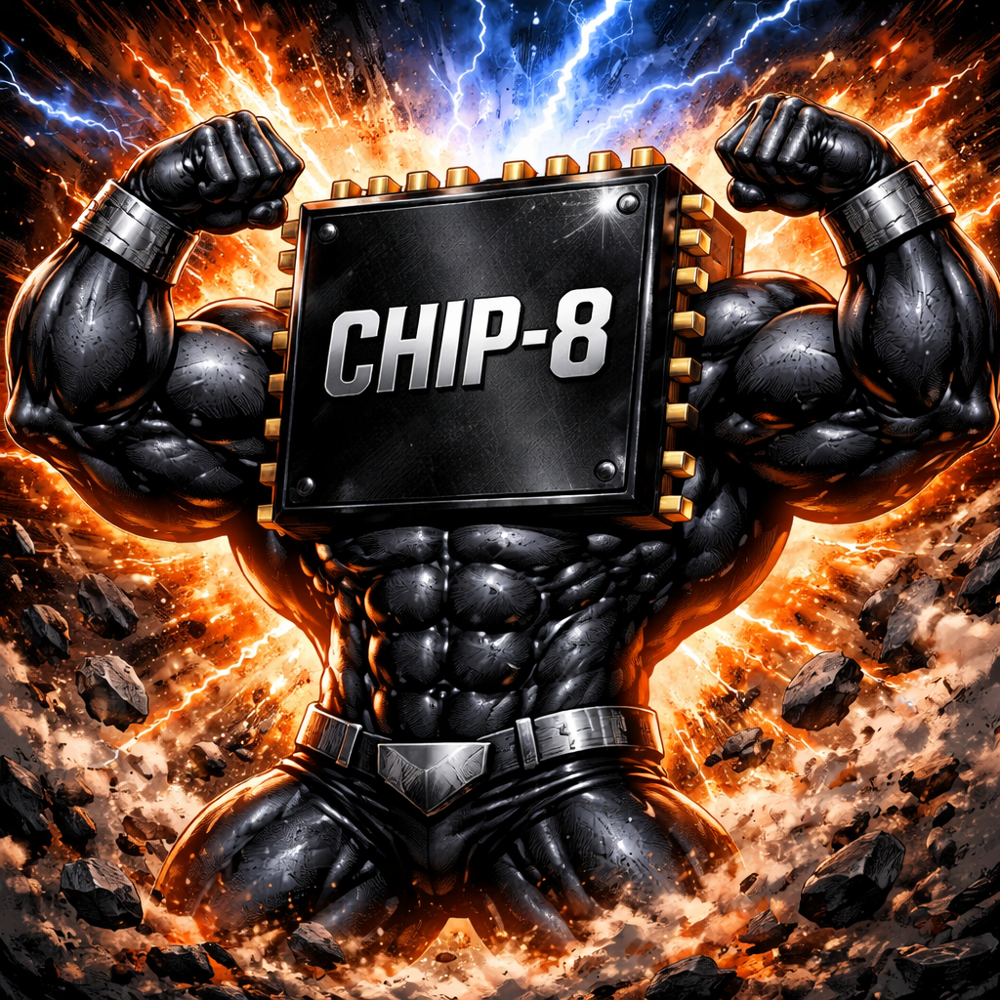

<h1 align="center">
    <br>
    
    <br>
    ciotto - The CHIP-8 Emulator
    <br>
</h1>

## Usage

First, clone the repository and build the project:

```bash
# clone the repository
git clone https://github.com/AntonioBerna/ciotto.git
cd ciotto

# build the project
make

# clean the build files
make clean
```

Then, you can run the emulator with a CHIP-8 ROM:

```
./chip8 --emu <rom.ch8>
```

> [!NOTE]
> You can find some CHIP-8 ROMs in the [roms](https://github.com/AntonioBerna/ciotto/tree/master/roms) directory.
